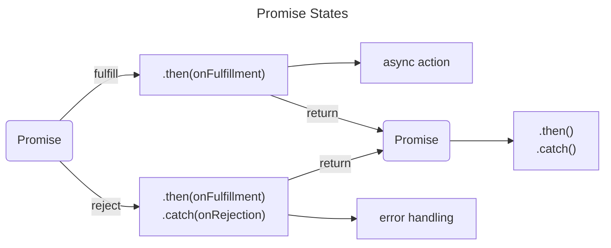

# JavaScript | Asynchronous

## Pendahuluan

Selamat datang di artikel ini yang akan membahas tentang JavaScript asynchronous. JavaScript merupakan salah satu bahasa pemrograman yang sangat populer di dunia web development. Salah satu fitur yang membuatnya begitu kuat adalah kemampuannya dalam menangani kode asinkron atau asynchronous code.

Pada dasarnya, ketika kita menulis kode JavaScript, secara default ia akan dieksekusi secara synchronous atau sekuensial. Artinya, setiap baris kode akan dieksekusi satu per satu secara berurutan sampai semua tugas selesai dilakukan. Namun, ada situasi tertentu di mana kita perlu menjalankan beberapa tugas secara bersamaan atau non-blocking agar aplikasi terasa lebih responsif dan efisien.

Di sinilah konsep asynchronous masuk ke dalam permainan. Dengan menggunakan fitur ini, kita dapat menjalankan beberapa tugas dengan cara yang tidak memblokir eksekusi baris kode lainnya. Sebagai contoh, saat mengirim permintaan ajax untuk mengambil data dari server, kita tidak ingin aplikasi berhenti melakukan proses lainnya hingga data tersebut diterima. Dalam situasi seperti itulah pentingnya penggunaan asynchronous code dalam pengembangan web.

Dengan memahami dan menerapkan konsep asynchronous pada JavaScript, Kamu dapat meningkatkan performa dan responsivitas aplikasi Kamu dengan baik. Artikel ini akan membahas perbedaan antara synchronous dan asynchronous code, memberikan contoh sintaks-sintaks penting dalam JavaScript asynchronous, serta mengajarkan Kamu cara menggunakan teknik-teknik seperti callback functions, promise, async/await untuk mengelola kode asinkron dengan lebih efisien.

## Apa itu JavaScript asynchronous?

JavaScript asynchronous adalah konsep dalam pemrograman web di mana kode eksekusi tidak berjalan secara sekuensial atau satu per satu. Sebaliknya, tugas-tugas yang membutuhkan waktu lama atau yang mengharuskan komunikasi dengan sumber eksternal, seperti permintaan ke server, dapat dijalankan tanpa menghentikan atau memperlambat eksekusi kode lainnya.

Dalam bahasa sehari-hari, jika aplikasi Kamu memiliki tugas yang memakan waktu, seperti mengambil data dari API atau melakukan operasi berkepanjangan pada basis data, menjalankan semua tugas ini secara bersamaan akan meningkatkan efisiensi dan responsivitas aplikasi Kamu. Inilah sebabnya mengapa JavaScript asynchronous sangat penting di dalam pengembangan web modern.

Dalam pemrograman JavaScript tradisional (synchronous), ketika kita menjalankan sebuah fungsi atau metode yang memerlukan waktu lama untuk menyelesaikan tugasnya, operasi ini akan "memblokir" eksekusi seluruh program sampai operasi tersebut selesai. Dengan pendekatan asynchronous, kita bisa melanjutkan menjalankan kode lain sambil menunggu hasil dari operasi tersebut tanpa harus terjebak dalam pemblokiran.

Penggunaan JavaScript asynchronous juga sangat berguna ketika bekerja dengan elemen interaktif pada halaman web. Misalnya, ketika pengguna melakukan input pada formulir dan ingin mendapatkan rekomendasi secara langsung saat mereka mengetik. Dengan menggunakan pendekatan asynchronous dan teknik AJAX, kita dapat memperbarui konten halaman web tanpa harus me-refresh seluruh halaman, memberikan pengalaman pengguna yang lancar dan responsif.

## Mengapa asynchronous Penting dalam Pengembangan Web?

asynchronous programming adalah konsep yang sangat penting dalam pengembangan web modern. Dalam paradigma synchronous, proses eksekusi kode dilakukan secara berurutan, satu per satu. Namun, saat menghadapi tugas yang membutuhkan waktu lama seperti mengambil data dari server atau melakukan permintaan jaringan lainnya, proses ini dapat menyebabkan keseluruhan aplikasi menjadi lambat dan tidak responsif.

asynchronous programming memungkinkan kita untuk melanjutkan eksekusi kode tanpa harus menunggu tugas yang memakan waktu lama selesai terlebih dahulu. Dengan menggunakan teknik ini, aplikasi dapat tetap merespons input pengguna dan menjalankan tugas-tugas lainnya selama proses asynchronuous berjalan di background.

Dalam dunia pengembangan web yang semakin kompleks dan interaktif, kecepatan dan responsivitas adalah kunci untuk memberikan pengalaman pengguna yang baik. asynchronous programming memainkan peran penting dalam mencapai tujuan ini karena mampu meningkatkan performa aplikasi secara signifikan.

Selain itu, aplikasi web modern sering kali terhubung dengan berbagai layanan pihak ketiga seperti API atau sistem backend. Pada kasus seperti ini, menggunakan pendekatan synchronous akan sangat tidak efisien karena setiap kali melakukan permintaan ke layanan pihak ketiga akan menghentikan eksekusi program hingga mendapatkan responsnya. Dengan menggunakan asynchronous programming, kita dapat mengirim beberapa permintaan secara bersamaan tanpa harus menunggu respons satu per satu, meningkatkan efisiensi dan kecepatan aplikasi secara keseluruhan.

## Perbedaan Antara asynchronous dan Synchronous Code

Ketika berbicara tentang pengembangan web, penting untuk memahami perbedaan antara asynchronous dan synchronous code. Synchronous code adalah tipe kode yang dieksekusi secara berurutan, artinya setiap baris kode harus menunggu baris kode sebelumnya selesai dijalankan. Di sisi lain, asynchronous code tidak menunggu proses sebelumnya selesai sebelum melanjutkan dengan eksekusi kode berikutnya.

Salah satu keuntungan menggunakan asynchronous code adalah meningkatkan performa aplikasi web. Ketika kita memiliki tugas yang memerlukan waktu lama atau koneksi jaringan yang lambat, menggunakan synchronous code dapat membuat aplikasi terasa lambat atau bahkan terhenti sementara menunggu respons dari server. Dengan menggunakan asynchronous code, kita dapat melanjutkan eksekusi kode lainnya tanpa harus menunggu respons dari server.

Selain itu, asynchronous code juga memungkinkan kita untuk melakukan banyak tugas secara bersamaan atau paralel. Misalnya, dalam pengembangan aplikasi web yang kompleks, kita mungkin perlu mengambil data dari beberapa sumber yang berbeda secara bersamaan. Dengan menggunakan asynchronous code dan konsep seperti AJAX (asynchronous JavaScript and XML), kita dapat mengirim permintaan ke beberapa server secara bersamaan tanpa harus menunggu satu permintaan selesai baru kemudian mengirim permintaan berikutnya.

Namun demikian, penting juga untuk mencatat bahwa dalam beberapa situasi tertentu, synchronous code bisa lebih mudah untuk ditulis dan dipahami. Dengan synchronous code, kita dapat memastikan bahwa setiap langkah dalam proses dieksekusi secara berurutan dan dapat mengontrol aliran program dengan lebih mudah. Jadi, dalam pengembangan aplikasi yang sederhana atau saat performa tidak menjadi masalah utama, synchronous code bisa menjadi pilihan yang lebih sederhana dan terjamin.

## Contoh Sintaks asynchronous JavaScript

JavaScript memiliki beberapa sintaks untuk mengimplementasikan kode asynchronous. Salah satu yang paling umum adalah menggunakan callback functions. Dalam pendekatan ini, kita memberikan sebuah fungsi sebagai argumen kepada fungsi lainnya untuk dieksekusi setelah operasi asynchronous selesai dilakukan.

Sebagai contoh, kita akan melihat penggunaan XMLHttpRequest dalam JavaScript untuk melakukan permintaan ke server secara asynchronous. Berikut adalah contoh sintaks:

```javascript copy
function fetchData(url, callback) {
  var xhr = new XMLHttpRequest();
  xhr.open("GET", url);
  xhr.onreadystatechange = function () {
    if (xhr.readyState === XMLHttpRequest.DONE && xhr.status === 200) {
      callback(xhr.responseText);
    }
  };
  xhr.send();
}

fetchData("https://www.example.com/data", function (response) {
  console.log(response);
});
```

Pada contoh di atas, kita membuat sebuah fungsi fetchData yang menerima dua argumen: URL untuk permintaan data dan callback function yang akan dieksekusi setelah data diterima dari server. Fungsi ini menggunakan objek XMLHttpRequest untuk melakukan permintaan GET ke URL yang diberikan dan mendapatkan respon dari server.

Setelah respon diterima dengan sukses (state readyState bernilai DONE dan status bernilai 200), maka callback function akan dipanggil dengan parameter respon dari server sebagai input. Pada contoh di atas, kita mencetak respon tersebut ke konsol menggunakan console.log.

## Memahami Callback Functions dalam asynchronous JavaScript

Callback functions adalah salah satu konsep yang penting dalam asynchronous JavaScript. Dalam pengembangan web, seringkali kita perlu melakukan tindakan tertentu setelah suatu proses asynchronous selesai dilakukan. Callback functions memungkinkan kita untuk mengeksekusi kode setelah operasi asynchronous tersebut selesai.

Gagasan di balik callback functions adalah bahwa kita memberikan fungsi sebagai argumen kepada fungsi lainnya, sehingga fungsi tersebut dapat dipanggil kembali setelah operasi asynchonous selesai berjalan. Misalnya, ketika melakukan permintaan HTTP menggunakan AJAX, kita bisa memberikan sebuah fungsi sebagai callback yang akan dipanggil ketika respons dari server diterima.

Berikut adalah contoh sederhana untuk memahami penggunaan callback functions:

```javascript copy
// Fungsi async yang mengambil data dari server simulasi
function fetchDataFromServer(callback) {
  setTimeout(function () {
    const data = "Data dari server";
    callback(data);
  }, 2000); // Simulasi waktu pengambilan data selama 2 detik
}

// Callback function yang akan dipanggil setelah data diterima
function processReceivedData(data) {
  console.log("Data yang diterima dari server: " + data);
}

// Menggunakan callback untuk mengambil dan memproses data
fetchDataFromServer(processReceivedData);
console.log("Permintaan data sedang diproses...");
```

Pada contoh di atas, kita memiliki fetchDataFromServer, sebuah fungsi asinkron yang mengambil data dari server simulasi dengan menggunakan setTimeout. Fungsi ini menerima sebuah callback sebagai argumen.

Kemudian, ada processReceivedData, yang merupakan callback function. Callback ini akan dipanggil oleh fetchDataFromServer ketika data diterima.

Kemudian, kita menggunakan fetchDataFromServer dengan memberikan processReceivedData sebagai callback. Ketika kita memanggil fetchDataFromServer, kode ini tidak akan menunggu data diterima. Sebaliknya, ia akan melanjutkan eksekusi kode berikutnya dan mencetak "Permintaan data sedang diproses...".

Setelah 2 detik (simulasi waktu pengambilan data), data diterima, dan callback processReceivedData dipanggil dengan data sebagai argumen. Hasilnya akan dicetak ke konsol.

## Menggunakan Promise untuk Mengatasi Callback Hell

Callback hell, juga dikenal sebagai "Pyramid of Doom," terjadi ketika kita memiliki banyak callback bersarang dalam kode JavaScript, yang membuatnya sulit dibaca dan dikelola.

```javascript copy
function loadDataFromServer(callback) {
  setTimeout(function () {
    const data = "Data dari server";
    callback(data);
  }, 1000); // Simulasi waktu pengambilan data selama 1 detik
}

function processData(data, successCallback, errorCallback) {
  setTimeout(function () {
    if (data) {
      successCallback("Data berhasil diproses: " + data);
    } else {
      errorCallback("Terjadi kesalahan dalam pemrosesan data");
    }
  }, 1000); // Simulasi waktu pemrosesan data selama 1 detik
}

function displayResult(result) {
  console.log("Hasil: " + result);
}

function displayError(error) {
  console.error("Error: " + error);
}

loadDataFromServer(function (data) {
  processData(
    data,
    function (result) {
      displayResult(result);
    },
    function (error) {
      displayError(error);
    }
  );
});
```

Saat bekerja dengan asynchronous code dalam JavaScript, callback hell adalah masalah umum yang sering dihadapi oleh para pengembang. Callback hell terjadi ketika sebuah kode memiliki banyak callback yang bersarang satu sama lain, membuatnya sulit dibaca dan dipelihara.

Untungnya, JavaScript menyediakan solusi yang elegan untuk mengatasi callback hell, yaitu menggunakan Promise. Sebuah Promise adalah objek yang merepresentasikan sebuah nilai yang mungkin belum tersedia saat fungsi asynchronus sedang dieksekusi. Dengan menggunakan Promise, kita dapat mengubah kodisi callback menjadi kode berurutan yang lebih mudah dibaca dan dipelihara.



Promise memiliki tiga status: pending (sedang menunggu), fulfilled (berhasil), dan rejected (gagal). Ketika sebuah promise berhasil atau gagal, kita dapat menentukan tindakan apa yang harus dilakukan selanjutnya menggunakan metode .then() untuk handle kasus berhasil dan .catch() untuk handle kasus gagal.

Berikut contoh penggunaan Promise dalam mengubah callback hell menjadi kode berurutan:

```javascript copy
function loadDataFromServer() {
  return new Promise(function (resolve, reject) {
    setTimeout(function () {
      const data = "Data dari server";
      if (data) {
        resolve(data);
      } else {
        reject("Gagal mengambil data dari server");
      }
    }, 1000); // Simulasi waktu pengambilan data selama 1 detik
  });
}

function processData(data) {
  return new Promise(function (resolve, reject) {
    setTimeout(function () {
      if (data) {
        resolve("Data berhasil diproses: " + data);
      } else {
        reject("Terjadi kesalahan dalam pemrosesan data");
      }
    }, 1000); // Simulasi waktu pemrosesan data selama 1 detik
  });
}

function displayResult(result) {
  console.log("Hasil: " + result);
}

function displayError(error) {
  console.error("Error: " + error);
}

loadDataFromServer()
  .then(function (data) {
    return processData(data);
  })
  .then(function (result) {
    displayResult(result);
  })
  .catch(function (error) {
    displayError(error);
  });
```

Dalam contoh di atas, kita telah mengubah loadDataFromServer dan processData menjadi fungsi yang mengembalikan Promise. Kedua fungsi ini sekarang memiliki kemampuan untuk menyelesaikan Promise dengan menggunakan resolve jika berhasil atau reject jika terjadi kesalahan.

Kemudian, kita menggantikan callback hell dengan menggunakan .then dan .catch pada Promise. Setelah memanggil loadDataFromServer, kita mengikuti rangkaian .then untuk memproses data secara berurutan. Jika ada kesalahan di salah satu langkah, kita menangkapnya dengan menggunakan .catch untuk menampilkan pesan error.

Penggunaan Promise membuat kode menjadi lebih terstruktur dan mudah dibaca, mengatasi masalah callback hell yang dapat terjadi ketika banyak callback bersarang.

## Menerapkan Async/Await dalam JavaScript

Sejak diperkenalkan dalam ECMAScript 2017, async/await telah menjadi salah satu fitur yang paling populer dan powerful dalam JavaScript. Dengan menggunakan async/await, kita dapat menulis kode asynchronous dengan cara yang lebih terstruktur dan mudah dibaca. Async/await memungkinkan kita untuk menuliskan kode asynchronous seperti kode synchronous, tanpa menyebabkan blocking pada thread utama.

Untuk menggunakan async/await, pertama-tama kita harus menKamui sebuah function sebagai "async". Ini mengindikasikan bahwa function tersebut akan melakukan operasi asynchronous. Kemudian, kita dapat menggunakan kata kunci "await" di depan sebuah promise agar eksekusi kode berhenti sampai promise tersebut diselesaikan atau ditolak. Jika promise berhasil diselesaikan, nilai yang dihasilkan akan dikembalikan oleh await sebagai hasil dari eksekusi promise tersebut.

Salah satu keuntungan besar dari async/await adalah kemampuannya dalam menangani error secara elegan. Dalam blok try-catch biasa, kita dapat menangkap dan mengelola error yang mungkin terjadi selama eksekusi asynchronous code. Hal ini membuat debugging menjadi lebih mudah dan memperkuat kehKamulan aplikasi kita.

Contoh sederhana penggunaan async/await adalah ketika melakukan request HTTP dengan fetch API. Kita akan membuat sebuah function asinkron bernama getData() yang akan melakukan request ke server untuk mendapatkan data JSON. Dalam function ini, kita dapat menggunakan await untuk menjeda eksekusi sampai response dari server diterima. Setelah itu, kita dapat mengolah data tersebut dan mengembalikannya sebagai hasil dari function.

## Contoh Kasus Menggunakan asynchronous dan Synchronous Code

JavaScript asynchronous dan synchronous code dapat memiliki perbedaan signifikan dalam konteks pengembangan web. Mari kita lihat contoh kasus yang menunjukkan bagaimana menggunakan keduanya.

### Menggunakan asynchronous Code

Bayangkan Kamu sedang membangun sebuah aplikasi web yang mengunduh data dari API eksternal. Dalam kasus ini, menggunakan asynchronous code dapat memberikan pengalaman yang lebih responsif kepada pengguna. Kamu dapat membuat permintaan ke API tanpa harus menunggu responnya, sehingga pengguna tidak akan mengalami waktu tunggu yang lama.

Misalnya, jika Kamu ingin menampilkan daftar artikel terbaru di halaman utama situs web Kamu, Kamu bisa menggunakan asynchronous code untuk memuat data dari server secara paralel sambil melanjutkan eksekusi kode lainnya. Ini akan mengoptimalkan waktu muat halaman dan memberikan kesan profesional pada pengunjung situs Kamu.

### Menggunakan Synchronous Code

Sementara itu, ada juga situasi di mana synchronous code lebih cocok digunakan. Misalnya, jika Kamu memiliki beberapa operasi yang harus dieksekusi secara berurutan, menggunakan synchronous code dapat memastikan bahwa setiap operasi selesai sebelum melanjutkan ke operasi berikutnya.

Contohnya adalah ketika Kamu ingin memproses data dalam urutan tertentu atau melakukan pembaruan ke database dengan urutan spesifik. Dalam kasus-kasus semacam ini, synchronous code memberi jaminan bahwa setiap langkah dilakukan dengan benar dan tidak ada interupsi antara operasi-operasi tersebut.

Sebagai seorang pengembang web, penting untuk memahami situasi kapan harus menggunakan asynchronous atau synchronous code. Dengan memanfaatkan potensi keduanya dengan tepat, Kamu dapat meningkatkan performa aplikasi Kamu dan memberikan pengalaman yang lebih baik kepada pengguna.

## Kesimpulan

JavaScript asynchronous adalah fitur yang sangat penting dalam pengembangan web modern. Dalam artikel ini, telah dibahas berbagai aspek dan manfaat menggunakan asynchronous dalam kode JavaScript. Dengan memahami dan menguasai konsep-konsep tersebut, para pengembang dapat meningkatkan efisiensi dan performa aplikasi web mereka.

Keunggulan utama dari asynchronous code adalah kemampuannya untuk menjalankan tugas-tugas secara paralel, tanpa harus menunggu proses sebelumnya selesai. Hal ini memungkinkan aplikasi web untuk merespons dengan cepat terhadap interaksi pengguna dan menghindari terjadinya kebuntuan (blocking) pada antarmuka pengguna.

Selain itu, keberadaan fitur seperti callback functions, promise, dan async/await memberikan fleksibilitas yang besar dalam mengelola aliran eksekusi kode JavaScript. Pengembang dapat dengan mudah mengatur urutan tugas-tugas atau menangani error dengan lebih baik melalui mekanisme yang disediakan oleh asynchronous code.

Mengimplementasikan asynchronous code bukanlah hal yang sulit jika kita telah memahami prinsip-prinsip dasarnya. Dalam artikel ini, telah dijelaskan berbagai contoh sintaks dan cara-cara menggunakan fitur-fitur asynchronous tersebut. Jika digunakan dengan bijak dan diterapkan secara tepat, asynchronous code akan membantu meningkatkan kualitas pengembangan web serta memberikan pengalaman yang lebih baik bagi para pengguna.
