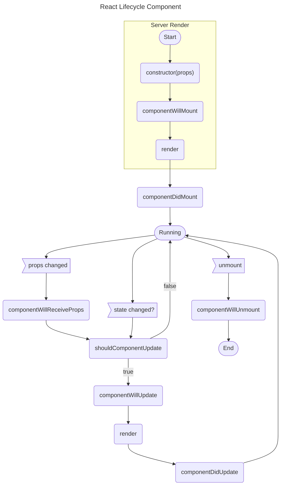

# React | Component

## Overview

Selamat datang dalam modul pembelajaran kami tentang React Component! Pada modul ini, kita akan menjelajahi komponen dalam React, bagaimana mereka berfungsi, mengapa kita perlu menggunakannya, jenis-jenis komponen yang ada, serta siklus hidup komponen. Kita juga akan membahas pentingnya membuat komponen yang dapat digunakan kembali dan cara melakukannya. Setiap sub bab akan menguraikan topik-topik tersebut dengan rinci, memberikan pemahaman mendalam tentang React Component.

## Pengertian Component pada React

Pertama-tama, mari kita menggali pemahaman tentang apa itu komponen dalam konteks React. Komponen adalah unit dasar dari pengembangan React. Mereka adalah potongan-potongan kecil dari antarmuka pengguna yang dapat dianggap sebagai "blok bangunan" dari aplikasi Anda. Setiap komponen memiliki perilaku dan tampilan yang terkait dengannya.

Dalam kode, komponen biasanya diimplementasikan sebagai kelas atau fungsi. Komponen memiliki dua jenis utama: komponen kelas (class components) dan komponen fungsi (functional components). Komponen kelas adalah kelas JavaScript yang meng-extend React.Component dan mengimplementasikan metode render(), sementara komponen fungsi adalah fungsi JavaScript yang mengembalikan elemen React.

Contoh penggunaan komponen dalam React:

```jsx copy showLineNumbers filename="welcome.jsx"
import React, { Component } from "react";

class Welcome extends Component {
  render() {
    return <h1>Selamat Datang di Modul React Component</h1>;
  }
}
```

Pada contoh di atas, kita memiliki komponen kelas Welcome yang menghasilkan elemen HTML sebagai tampilan komponen. Kita akan mempelajari lebih lanjut tentang berbagai jenis komponen dalam sub bab berikutnya.

## Kenapa Perlu Adanya Component

Mengapa kita memerlukan konsep komponen dalam pengembangan React? Komponen memainkan peran kunci dalam pengorganisasian dan pemeliharaan kode dalam proyek React. Berikut beberapa alasan mengapa komponen penting:

1. Reusabilitas: Komponen memungkinkan kita untuk menulis kode sekali dan menggunakannya di berbagai bagian aplikasi. Ini mengurangi duplikasi kode dan mempermudah pemeliharaan.

2. Pembagian Tugas: Dalam aplikasi yang kompleks, komponen memungkinkan pembagian tugas dan tanggung jawab. Setiap komponen bertanggung jawab atas tampilan dan perilaku tertentu.

3. Skalabilitas: Dengan menggunakan komponen, kita dapat dengan mudah menambah atau menghapus fitur tanpa mengganggu bagian lain dari aplikasi. Ini memudahkan dalam pengembangan yang berskala.

4. Pengujian yang Lebih Baik: Komponen yang terisolasi memudahkan pengujian unit, sehingga kita dapat memastikan bahwa setiap komponen berfungsi dengan baik.

## Jenis Component

Ada dua jenis utama komponen dalam React:

1. **Komponen Fungsi (Functional Components)**: Komponen fungsi adalah jenis komponen yang berbentuk fungsi JavaScript biasa. Mereka biasanya digunakan untuk komponen sederhana yang hanya memiliki tampilan dan tidak memiliki keadaan (state) sendiri. Contoh:

```jsx copy
function Greeting(props) {
  return <h1>Halo, {props.name}!</h1>;
}

// atau

const Greeting = (props) => {
  return <h1>Halo, {props.name}!</h1>;
};
```

2. **Komponen Kelas (Class Components)**: Komponen kelas adalah kelas JavaScript yang meng-extend React.Component. Mereka digunakan untuk komponen yang memiliki keadaan (state) dan perilaku yang lebih kompleks. Contoh:

```jsx copy
class Counter extends React.Component {
  constructor(props) {
    super(props);
    this.state = { count: 0 };
  }

  render() {
    return <p>Count: {this.state.count}</p>;
  }
}
```

Kedua jenis komponen memiliki peran dan kegunaan yang berbeda tergantung pada kebutuhan proyek.

## Life Cycle Component



React menyediakan siklus hidup (lifecycle) komponen yang memungkinkan kita untuk menangani berbagai peristiwa dalam siklus hidup komponen, seperti saat komponen pertama kali dibuat, diperbarui, atau dihapus dari DOM. Beberapa metode siklus hidup yang umum digunakan antara lain:

- `componentDidMount()`: Dipanggil setelah komponen pertama kali dirender ke DOM. Digunakan untuk memuat data atau menginisialisasi keadaan awal.

- `componentDidUpdate()`: Dipanggil setelah pembaruan komponen. Digunakan untuk melakukan tindakan setelah komponen diperbarui.

- `componentWillUnmount()`: Dipanggil sebelum komponen dihapus dari DOM. Digunakan untuk membersihkan sumber daya atau berhenti dari proses yang berjalan.

- Dan banyak lagi.

Siklus hidup komponen sangat penting untuk memahami cara mengelola keadaan dan efek samping dalam aplikasi React.

## Kenapa Harus Dibuat Reusable Component

Membuat komponen yang dapat digunakan kembali adalah praktik terbaik dalam pengembangan React. Ini memiliki beberapa manfaat utama:

1. Efisiensi Kode: Dengan komponen yang dapat digunakan kembali, Anda mengurangi duplikasi kode, sehingga memungkinkan pengembangan yang lebih efisien.

2. Pemeliharaan yang Mudah: Jika Anda perlu mengubah sesuatu, Anda hanya perlu memperbarui komponen tersebut di satu tempat, dan perubahan itu akan mencakup semua penggunaan komponen tersebut.

3. Konsistensi: Komponen yang dapat digunakan kembali memastikan konsistensi tampilan dan perilaku di seluruh aplikasi Anda.

4. Kolaborasi yang Lebih Baik: Tim pengembang dapat lebih mudah berkolaborasi ketika menggunakan komponen yang sudah ada sebagai bahan bangunan.

Untuk membuat komponen yang dapat digunakan kembali, kita perlu memikirkan dengan baik tentang prop (properti) yang diterima oleh komponen dan cara mengisolasi logika internal dari tampilan.

Mari pertimbangkan contoh kasus di mana kita tidak membuat komponen yang dapat digunakan kembali. Misalnya, kita memiliki dua komponen yang serupa: ProductDetail dan ProductList.

### Tanpa Komponen yang Dapat Digunakan Kembali

```jsx copy showLineNumbers filename="products.jsx"
import React from "react";

function ProductDetail(props) {
  return (
    <div>
      <h2>{props.product.name}</h2>
      <p>{props.product.description}</p>
      <p>Price: ${props.product.price}</p>
    </div>
  );
}

function ProductList(props) {
  return (
    <div>
      {props.products.map((product) => (
        <ProductDetail key={product.id} product={product} />
      ))}
    </div>
  );
}
```

Ketika kita ingin menampilkan detail produk di tempat lain dalam aplikasi, kita harus menulis kode serupa lagi, dan ini bisa mengarah pada duplikasi kode yang tidak efisien.

### Dengan Komponen yang Dapat Digunakan Kembali

Sebaliknya, jika kita membuat komponen yang dapat digunakan kembali, kita bisa menghindari duplikasi kode. Mari kita lihat contoh penggunaan komponen yang dapat digunakan kembali.

```jsx copy showLineNumbers filename="product-detail.jsx"
import React from "react";

function ProductDetail(props) {
  return (
    <div>
      <h2>{props.product.name}</h2>
      <p>{props.product.description}</p>
      <p>Price: ${props.product.price}</p>
    </div>
  );
}

export default ProductDetail;
```

```jsx copy showLineNumbers filename="products.jsx"
import React from "react";
import ProductDetail from "./Product";

function ProductList(props) {
  return (
    <div>
      {props.products.map((product) => (
        <ProductDetail key={product.id} product={product} />
      ))}
    </div>
  );
}
```

Dengan pendekatan ini, kita memiliki komponen ProductDetail yang dapat digunakan kembali di seluruh aplikasi. Jika kita ingin menampilkan detail produk di tempat lain, kita hanya perlu mengimpor dan menggunakan kembali komponen ProductDetail.

## Cara Membuat Reusable Component

Untuk membuat komponen yang dapat digunakan kembali, kita perlu mematuhi beberapa prinsip dasar:

1. Pisahkan Logika dan Tampilan: Pisahkan logika dari tampilan komponen. Logika harus berada dalam metode komponen, sementara tampilan harus terisolasi dalam metode render().

2. Gunakan Prop: Manfaatkan prop untuk mengirim data ke komponen dan membuatnya lebih fleksibel. Prop memungkinkan komponen menerima data dari luar dan berperilaku sesuai dengan data tersebut.

3. Dokumentasi yang Baik: Tulis dokumentasi yang jelas untuk komponen Anda. Ini akan membantu pengguna komponen memahami cara menggunakannya.

4. Uji Unit: Pastikan untuk menguji komponen Anda secara terpisah untuk memastikan bahwa mereka berfungsi dengan baik sebelum digunakan dalam aplikasi.

## Kesimpulan

Dalam modul pembelajaran ini, kami telah membahas pengenalan tentang komponen dalam React, jenis-jenis komponen, siklus hidup komponen, dan pentingnya membuat komponen yang dapat digunakan kembali. Dengan pemahaman ini, Anda akan dapat mengembangkan aplikasi React yang lebih efisien, mudah dikelola, dan skalabel. Selanjutnya, kami akan menjelajahi topik-topik yang lebih mendalam dalam pengembangan React. Teruslah belajar dan berkembang!
