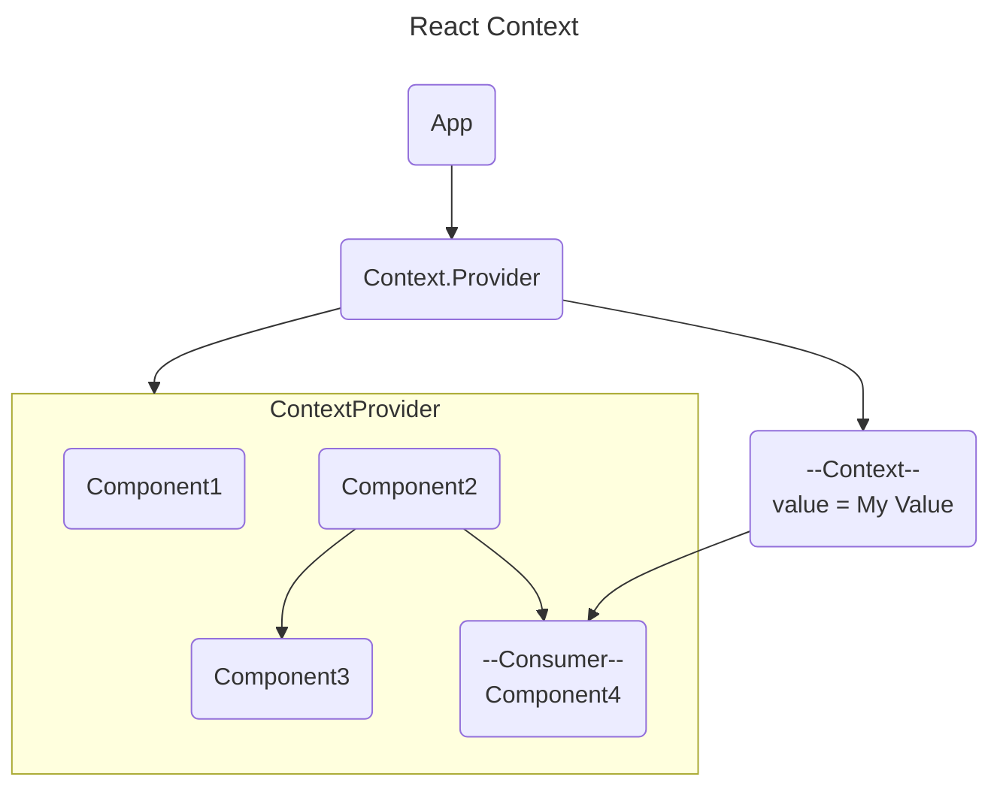

import { Callout } from "nextra/components";

# Global State | Context

## Overview

Sebelumnya kita memparsing atau melemparkan sebuah data menggunakan props ke beberapa komponen yang kita buat. Namun seiring berjalannya waktu dan perkembangan aplikasi yang telah di develop membuat kita cukup menderita dan exhausted ketika masih melakukan parsing data antar komponen seperti berikut.

```javascript
import React from "react";

const App = () => {
  return (
    <div className="app">
      <SomeComponent
        user={user}
        otherProps={otherProps}
        otherPropsAgain={otherPropsAgain}
        andSomeOtherPropsPassRightHere={whatEver}
      />
    </div>
  );
};

export default App;
```

React Context merupakan salah satu fitur yang kuat dalam ekosistem React yang memungkinkan kita berbagi data di antara komponen-komponen tanpa harus menyampaikan prop secara langsung melalui hirarki komponen. Context menyederhanakan manajemen state global dalam aplikasi React. Dengan menggunakan Context, kita dapat mengakses data dari mana saja dalam pohon komponen tanpa perlu menyusun prop-drilling yang kompleks.

Penggunaan Context sangat penting ketika kita memiliki data yang dibutuhkan oleh banyak komponen di dalam aplikasi kita. Sebagai contoh, tema aplikasi, informasi pengguna yang masuk, atau preferensi pengguna dapat diakses melalui Context.

## Pengertian Context

Terkadang, data dilempar dari atas ke bawah (parent to child) melalui props, namun ada beberapa kondisi dan situasi dimana terdapat sebuah data (seperti tema, pilihan bahasa) yang dibutuhkan oleh banyak komponen didalam aplikasi kita.

Context adalah cara untuk menyampaikan data melalui pohon komponen tanpa harus menyusun prop secara manual di setiap tingkat. Context memberikan cara untuk mengonfigurasi dan berbagi nilai-nilai ini pada tingkat global, membuatnya dapat diakses oleh komponen-komponen di seluruh aplikasi.

Context memberikan sebuah cara untuk melakukan passing sebuah data melalui component tree tanpa perlu passing props di setiap level. Dengan kata lain, Context seperti sebuah variabel global yang bisa diakses kapanpun dan dimanapun tanpa parsing props di setiap komponen yang kita miliki.



## Kelebihan dan Kekurangan Context

Kelebihan:

- **Pemeliharaan State yang Mudah**: Context memungkinkan kita untuk mengelola state secara global tanpa perlu menyusun banyak prop. Ini membuat pemeliharaan state menjadi lebih mudah dan mengurangi kompleksitas kode.
- **Mengurangi Prop-Drilling**: Dengan menggunakan Context, kita dapat menghindari prop-drilling, yaitu menyalurkan prop dari komponen ke komponen. Hal ini membuat kode lebih bersih dan lebih mudah dipahami.

Kekurangan:

- **Memerlukan Perhatian Khusus untuk Kinerja**: Tidak direkomendasikan untuk mengkombinasikan Context dengan hook lain seperti useReducer untuk merubah sebuah nilai karena alasan performa
- **Perubahan Nilai Dapat Men-trigger Render Ulang** : Ketika nilai dari sebuah Context berubah atau diganti, maka seluruh component yang mengkonsumsi Context akan re-render

## Kapan menggunakan Context

- Membutuhkan sebuah manajemen State yang simple
- Passing beberapa data secara mendalam tanpa perlu menggunakan Redux
- Poin plus ketika kita memiliki aplikasi dengan skala kecil ke menengah

## Apa saja penggunaan Context pada umumnya

Karena masalah kekurangan yang ada pada bagian [Kelebihan dan Kekurangan](#kelebihan-dan-kekurangan-context) diatas, umumnya penggunaan Context dapat diterapkan untuk beberapa fitur yang tingkat perubahan nilainya tidak sering dilakukan, contohnya seperti berikut:

- Tema
- Konfigurasi aplikasi
- Username dari user yang telah login
- Pengaturan user
- Preferensi bahasa
- etc

## Langkah-Langkah Implementasi Context

<Callout type="info" emoji="ℹ️">
  Didalam contoh ini, kita menggunakan TailwindCSS sebagai pilihan framework css
  dan Shadcn/ui sebagai pilihan reusable components.
</Callout>

1. Buat sebuah file yang nantinya digunakan untuk membuat Context dengan menggunakan method `createContext`. Di skenario ini, kita akan membuat suatu Context yang nantinya dapat merubah tema dari website kita, dimana pada file ini nantinya akan meng-export dua hal, yaitu `ThemeProvider` sebagai component wrapper agar context dapat digunakan dan juga sebuah hooks yang bernama `useTheme`.

```jsx copy showLineNumbers filename="src/utils/contexts/theme.jsx"
import { createContext, useMemo, useState, useContext, useEffect } from "react";

const initialState = {
  theme: "system",
  setTheme: () => null,
};

const ThemeProviderContext = createContext(initialState);

export function ThemeProvider({
  children,
  defaultTheme = "system",
  storageKey = "vite-ui-theme",
  ...props
}) {
  const [theme, setTheme] = useState(
    () => localStorage.getItem(storageKey) || defaultTheme
  );

  useEffect(() => {
    const root = window.document.documentElement;

    root.classList.remove("light", "dark");

    if (theme === "system") {
      const systemTheme = window.matchMedia("(prefers-color-scheme: dark)")
        .matches
        ? "dark"
        : "light";

      root.classList.add(systemTheme);
      return;
    }

    root.classList.add(theme);
  }, [theme]);

  const value = useMemo(
    () => ({
      theme,
      setTheme: (theme) => {
        localStorage.setItem(storageKey, theme);
        setTheme(theme);
      },
    }),
    [theme]
  );

  return (
    <ThemeProviderContext.Provider {...props} value={value}>
      {children}
    </ThemeProviderContext.Provider>
  );
}

export const useTheme = () => {
  const context = useContext(ThemeProviderContext);

  if (context === undefined)
    throw new Error("useTheme must be used within a ThemeProvider");

  return context;
};
```

2. Import `ThemeProvider` yang telah dibuat sebelumnya dan bungkus component tree dengan `ThemeProvider` pada file `main.jsx`.

```jsx copy showLineNumbers filename="src/main.jsx" {5, 8, 10}
import ReactDOM from "react-dom/client";

import App from "@/routes";

import { TokenProvider } from "@/utils/contexts/token";

ReactDOM.createRoot(document.getElementById("root")!).render(
  <ThemeProvider>
    <App />
  </ThemeProvider>
);
```

3. Setelah itu kita dapat memanggil hook `useTheme` dan merubah nilai tema di semua halaman/component yang kita buat asalkan component tersebut masih dalam lingkup `ThemeProvider`.

```jsx copy showLineNumbers filename="src/components/navbar.jsx" {5, 8, 12-14}
/* ... */

import { Button } from "@/components/ui/button";

import { useTheme } from "@/utils/contexts/theme";

const SomeComponent = () => {
  const { setTheme } = useTheme();

  return (
    /* ... */
    <Button onClick={() => setTheme("light")}>Light</Button>
    <Button onClick={() => setTheme("dark")}>Dark</Button>
    <Button onClick={() => setTheme("system")}>System</Button>
    /* ... */
  )
};
```

## Kesimpulan

Dengan menggunakan React Context, kita dapat mengelola state secara global dengan lebih efisien, menghindari prop-drilling, dan membuat kode lebih bersih. Penting untuk memahami kelebihan, kekurangan, dan best practice penggunaan Context agar dapat mengimplementasikannya secara optimal dalam pengembangan aplikasi React. Context adalah alat yang kuat ketika digunakan dengan bijak, dan dapat meningkatkan pengalaman pengembangan React secara keseluruhan.
