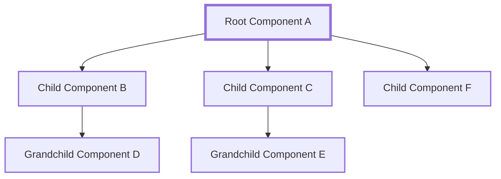

# React | Props

## Overview

Selamat datang dalam modul pembelajaran tentang React Props! Modul ini akan membantu kita memahami konsep dasar React Props, mengapa hal ini penting dalam pengembangan aplikasi berbasis React, perbedaan antara Props dan State, serta bagaimana mengimplementasikannya dalam class component dan functional component. Selain itu, kita juga akan membahas kekurangan dari penggunaan Props.

## Pengertian Props

Props adalah singkatan dari "properties," yang merupakan mekanisme penting dalam React untuk mengirim data dari satu komponen ke komponen lainnya. Props adalah objek yang berisi informasi yang dapat kita kirimkan dari komponen "induk" ke komponen "anak." Props adalah bagian fundamental dari komponen dalam ekosistem React dan membantu kita membangun aplikasi yang dinamis dan fleksibel.

Props biasanya didefinisikan sebagai atribut dalam elemen JSX saat kita menggunakan komponen. Misalnya, jika kita memiliki komponen bernama Product dan ingin mengirimkan informasi produk ke dalamnya, kita akan menggunakan props. Berikut adalah contoh sederhana penggunaan props:

```jsx copy showLineNumbers filename="products.jsx"
import React from "react";

function Product(props) {
  return (
    <div>
      <h2>{props.name}</h2>
      <p>{props.price}</p>
    </div>
  );
}

function App() {
  return <Product name="Laptop" price="$1000" />;
}
```

Pada contoh di atas, prop name dan price dikirim dari komponen App ke komponen Product untuk menampilkan nama dan harga produk.

## Kenapa Props itu Penting dalam React

Props adalah salah satu elemen kunci dalam konsep "komposisi komponen" dalam React. Props memungkinkan kita untuk membagi aplikasi ke dalam komponen-komponen yang lebih kecil dan dapat digunakan kembali. Ini sangat penting karena:

1. Reusable Components: Dengan menggunakan props, kita dapat membuat komponen yang dapat digunakan kembali untuk berbagai konteks, mengurangi duplikasi kode, dan mempermudah pemeliharaan.

2. Component Communication: Props memungkinkan komunikasi antara komponen dalam hirarki komponen React. Ini memungkinkan kita untuk mentransfer data dan informasi antar komponen dengan cara yang jelas dan terstruktur.

3. Dynamic Rendering: Props memungkinkan kita untuk merender komponen dengan data yang dinamis. Ini memungkinkan pembuatan aplikasi yang dapat beradaptasi dengan data yang berubah atau input pengguna.

4. Separation of Concerns: Props memisahkan data dari logika komponen, yang merupakan prinsip yang baik dalam pengembangan perangkat lunak. Ini membuat kode lebih bersih dan lebih mudah dipahami.

## Apa Perbedaan Props dengan State

Props dan State adalah dua konsep yang penting dalam React, tetapi mereka memiliki perbedaan mendasar:

**Props (Properties)**:

- Props adalah data yang dikirimkan dari komponen "induk" ke komponen "anak."
- Props bersifat read-only, artinya tidak bisa diubah oleh komponen yang menerimanya.
- Digunakan untuk mengirim data ke dalam komponen dan membuat komponen menjadi lebih fleksibel dan dinamis.

**State**:

- State adalah data yang dikelola oleh komponen itu sendiri.
- State bersifat mutable, artinya dapat diubah oleh komponen yang mengelolanya.
- Digunakan untuk menyimpan data yang berubah selama siklus hidup komponen, seperti nilai input pengguna atau status tertentu.

## Kekurangan dari Penggunaan Props

Meskipun Props memiliki banyak kelebihan, ada beberapa kekurangan yang perlu kita pertimbangkan:

1. **Prop Drilling**: Ketika aplikasi kita memiliki banyak tingkatan komponen di dalam hirarki, penggunaan props untuk mengirim data dari komponen ke komponen bisa menjadi rumit dan memakan waktu. Ini dikenal sebagai "prop drilling," dan dapat membuat kode menjadi sulit dipahami.

2. **Read-Only**: Props adalah read-only, yang berarti kita tidak dapat mengubah nilai prop langsung di dalam komponen anak. Jika kita perlu mengubah data, kita harus memperbarui data di komponen "induk" dan mengirimkannya lagi ke komponen anak.

3. **Kompleksitas Codebase**: Dalam aplikasi yang sangat besar, penggunaan props untuk mengirim data ke komponen dapat menghasilkan banyak prop yang harus dikelola, yang dapat meningkatkan kompleksitas codebase.



Diagram di atas menggambarkan hirarki komponen di dalam aplikasi React. Root Component (A) memiliki tiga Child Components (B, C, dan F), masing-masing dengan Grandchild Component (D dan E). Props Drilling terjadi ketika kita perlu mengirimkan data dari Root Component (A) ke Grandchild Component (D dan E) melalui Child Components (B, C, dan F).

Ketika kita memiliki banyak tingkat komponen di dalam hirarki, penggunaan props untuk mengirim data dari A ke D atau E melalui B atau C bisa menjadi rumit dan menghasilkan "prop drilling." Hal ini terutama berlaku jika data harus dilewati melalui beberapa tingkat komponen.

Prop drilling dapat menyebabkan kode menjadi sulit dipelihara dan membingungkan. Untuk mengatasi masalah ini, kita dapat menggunakan teknik seperti Context API atau Redux untuk memudahkan pengelolaan state dan komunikasi antar komponen di dalam aplikasi React yang kompleks.

## Contoh Implementasi Props pada Class Component dan Functional Component

### Implementasi Props pada Class Component

Kita akan menggunakan class component untuk contoh ini. Berikut adalah contoh implementasi props pada class component:

```jsx copy showLineNumbers filename="greeting.jsx"
import React, { Component } from "react";

class Greeting extends Component {
  render() {
    return <h1>Hello, {this.props.name}!</h1>;
  }
}

class App extends Component {
  render() {
    return <Greeting name="John" />;
  }
}

export default App;
```

### Implementasi Props pada Functional Component

Sekarang, mari lihat bagaimana kita dapat mengimplementasikan props pada functional component:

```jsx copy showLineNumbers filename="greeting.jsx"
import React from "react";

function Greeting(props) {
  return <h1>Hello, {props.name}!</h1>;
}

function App() {
  return <Greeting name="John" />;
}

export default App;
```

Pada kedua contoh di atas, kita mengirimkan prop name dari komponen App ke komponen Greeting untuk menampilkan pesan salam.

## Implementasi Default Props Sebagai Nilai Awal

Dalam React, default props adalah cara untuk memberikan nilai default kepada prop komponen jika prop tersebut tidak disediakan oleh komponen induk. Ini memungkinkan komponen untuk bekerja dengan baik bahkan jika prop tertentu tidak diatur atau ditulis pada komponen induk.

- Functional Component

```jsx copy showLineNumbers filename="greeting.jsx"
import React from "react";

function GreetingFunctional({ name = "Guest" }) {
  return (
    <div>
      <p>Hello, {name}!</p>
    </div>
  );
}

export default GreetingFunctional;
```

Dalam contoh di atas, kami menggunakan destructuring dalam parameter fungsi komponen untuk mengambil prop name dan sekaligus memberikan nilai default "Guest" jika prop tersebut tidak diberikan.

- Class Component

```jsx copy showLineNumbers filename="greeting.jsx"
import React, { Component } from "react";

class GreetingClass extends Component {
  render() {
    const { name = "Guest" } = this.props;

    return (
      <div>
        <p>Hello, {name}!</p>
      </div>
    );
  }
}

export default GreetingClass;
```

Pada contoh di atas, kita menggunakan destructuring dalam metode render dari komponen kelas untuk mengambil nilai name dari prop dan memberikan nilai default "Guest" jika tidak ada prop name yang diberikan.

Dengan diterapkannya default props memungkinkan kita untuk membuat komponen React yang lebih reusable dan lebih mudah untuk dirubah bahkan jika prop tertentu tidak disediakan oleh komponen induk.

## Kesimpulan

Dalam modul pembelajaran ini, kita telah menjelaskan konsep React Props yang penting dalam pengembangan aplikasi React. Props memungkinkan kita untuk mengirim data antar komponen, membuat komponen yang dapat digunakan kembali, dan memungkinkan komunikasi antar komponen. Kita juga memahami perbedaan antara Props dan State serta melihat contoh implementasinya dalam class component dan functional component.
